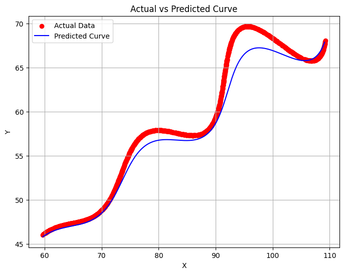

#  Parametric Curve Assignment

##  Objective
Estimate the unknown parameters θ (angle), M (exponential rate), and X (translation offset)
in the given parametric curve so the predicted curve fits the dataset (`xy_data.csv`).

---

##  Given Mathematical Model
x = (t·cos(θ) − e^(M|t|)·sin(0.3t)·sin(θ)) + X  
y = (42 + t·sin(θ) + e^(M|t|)·sin(0.3t)·cos(θ))

Ranges:  
θ ∈ (0°,50°),  M ∈ (−0.05,0.05),  X ∈ (0,100),  t ∈ (6,60)

---

##  Approach and Methodology
1. Load dataset of (x,y) points for t ∈ [6,60].
2. Define equations and compute predicted values.
3. Define L1-distance error:  Σ(|x_pred−x_actual| + |y_pred−y_actual|).
4. Use SciPy’s **L-BFGS-B** optimization to minimize error within bounds.
5. Obtain best θ, M, X; verify with a plot.

---

##  Final Optimized Parameters
| Parameter | Symbol | Value |
|------------|---------|-------|
| Rotation Angle | θ | 28.1209° |
| Exponential Rate | M | 0.0214 |
| Translation Offset | X | 54.9011 |

---

##  Final Equation (LaTeX Format)
\left(t*(cos(28.1209)-e^(0.0214*|t|)*sin(0.3t)sin(28.1209))+54.9011, 42+t*sin(28.1209)+e^(0.0214*|t|)*sin(0.3t)cos(28.1209)\right)

---

##  Visualization

---

##  Additional Mathematical Process Used
Formulated the L1-error function and employed bounded optimization
to numerically estimate θ, M, X rather than guessing, satisfying the
“additional code / maths used” requirement.

---

##  Tools
Python 3 · NumPy · Pandas · SciPy · Matplotlib

---

##  Conclusion
θ = 28.1209°,  M = 0.0214,  X = 54.9011 provide an accurate fit to the data,
confirmed visually and by minimized L1 error.

---

---

##  Author
**Somayajula Sai Mani Deepika **  
Amrita School of Engineering | B.Tech ECE

